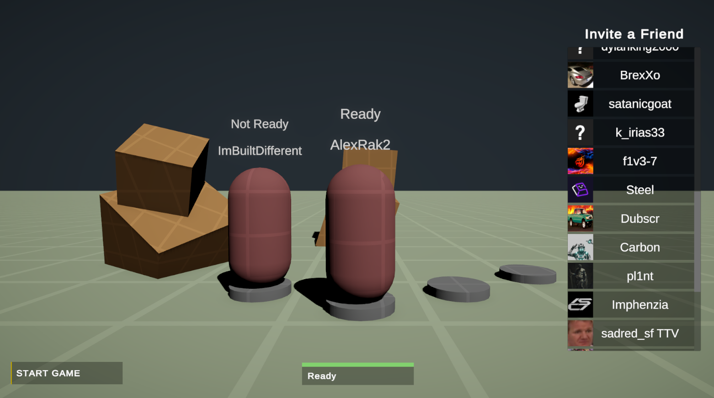
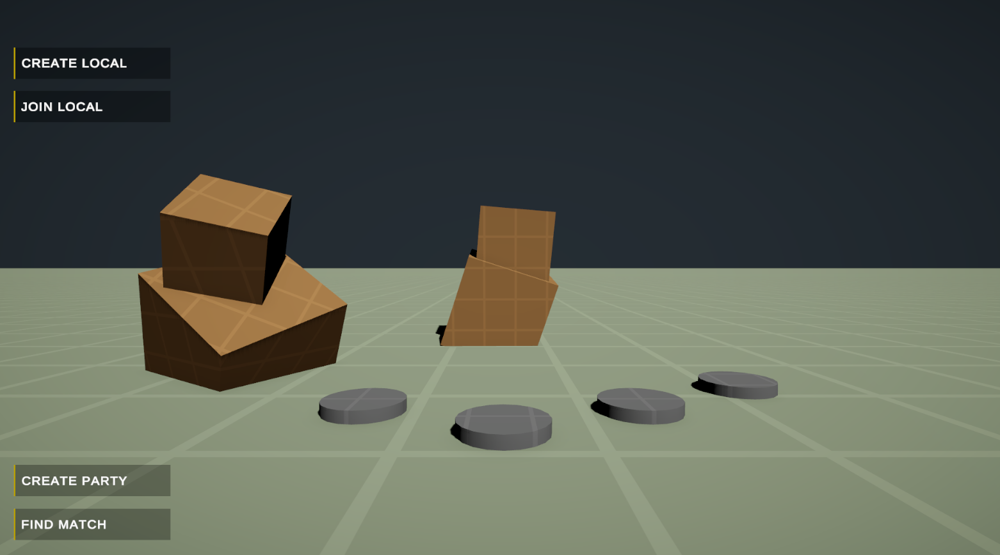
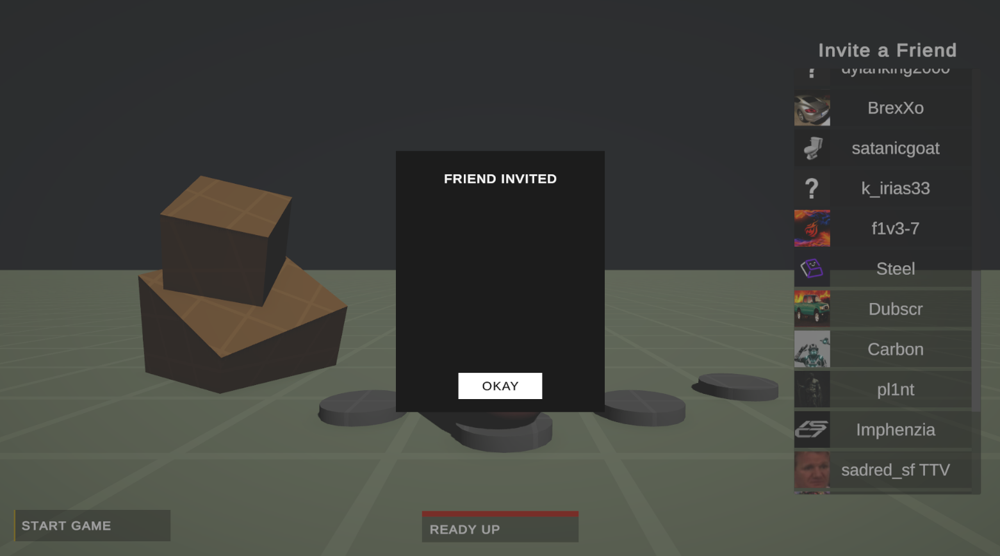

# Coop Party Template for Unity with Fishnet and Facepunch Steam

This is an advanced cooperative party system template designed for Unity, utilizing [Fishnet](https://github.com/FirstGearGames/FishNet) for networking and [Facepunch](https://wiki.facepunch.com/steamworks/) Steamworks for Steam integration.

I've developed this template for a project I'm currently working on and decided to share it with the community for free. This template provides a CO-OP main menu system. You can create a party, join an existing party or find a match.

One of the features of this template is its integration with Steam. You'll find a friends list menu where you can invite your Steam friends to join your party. All lobby connections are handled using Steam lobbies. All players must ready up in order to start the game. The game consist of a basic fps controller and demo scene. Enough for you guys to make a game out of.

## License

This project is licensed under the MIT License. Feel free to use it for your projects, modify it, or distribute it as per the terms of the license.

Thank you for checking out the Coop Party Template! If you have any questions or feedback, don't hesitate to reach out. 
[Discord](https://discord.com/invite/vB2NCBN44r) 

# Party with Friends. (Also friends list to invite)

# Main Menu

# Invite Friends

